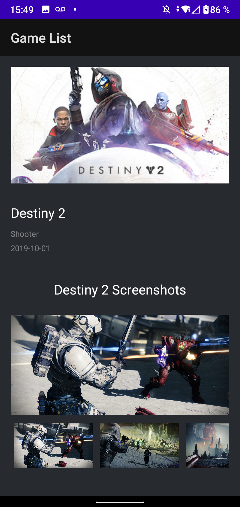
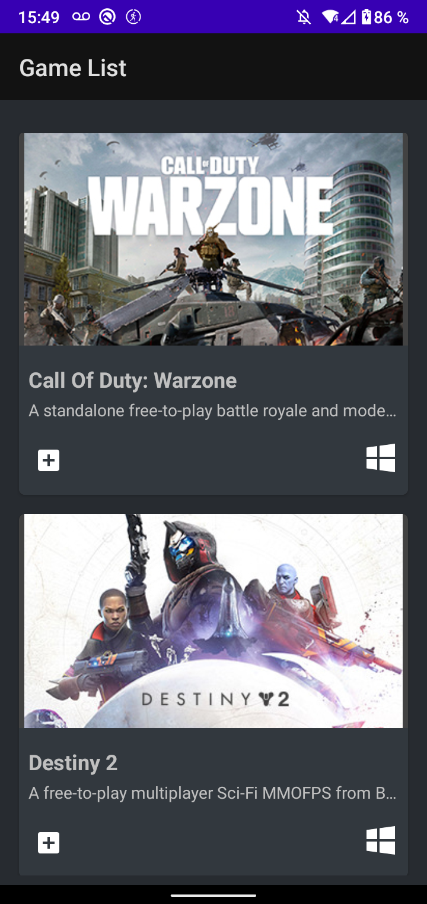

# Game List App

Lista de videojuegos de la api de <b>Free to Game</b>, cuenta también con una pantalla de detalles de un juego.

Elementos utilizados en esta aplicación:
* Retrofit para consumo de APIs con GSON Converter
* RecyclerViews con multiples funciones
* Patron MVVM
* Patron Singleton en Retrofit para evitar duplicación de codigo pesado
* Peticiones con Queries

|                            Pantalla principal                             |                                 Resultado                                  |
|:-------------------------------------------------------------------------:|:--------------------------------------------------------------------------:|
| |  |
